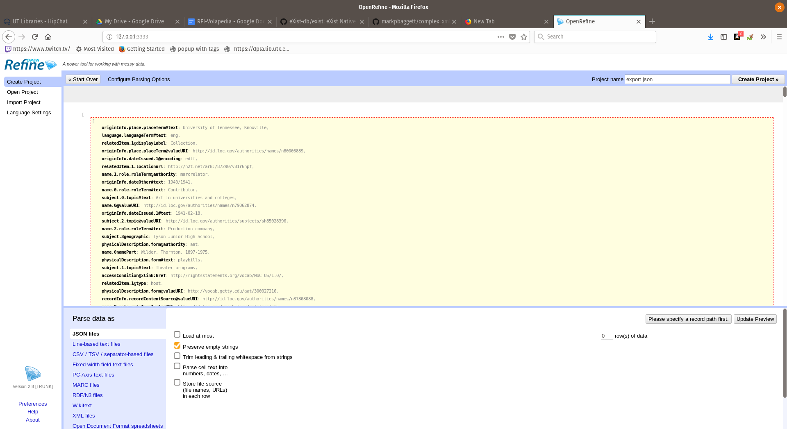

# Complex XML to OpenRefine

## About

This takes a complex XML file and generates a flat JSON file for easy importing into OpenRefine. Its purpose is to
losslessly create an OpenRefine project based on complex XML while keeping all metadata in a single row while still
allowing the user to semantically understand the relationships between the data so that it can ultimately be
exported back to XML with the same relationships that existed previously.

## How to Use

Install requirements and enter command like this:

```
python run.py -f my_xml_file.xml -x my_exported_json.xml -r /path/to/individual/record/in/xml/file
```

#### Flags

* Choose your file with -f or --file. Defaults to "sample_data/test.xml."
* Choose your exported json file with -x or --export. Defaults to "export.json."
* Specify the path to your record in XML input.  Defaults to "/modsCollection/mods."
* Specify the export format with -xf or --export_format. Defaults to "json."

## Importing to OpenRefine

1. Start OpenRefine and click "Create Project." Browse for your exported JSON file and click "Next."
2. Enter a Project Name and click the record in the preview window like the image below, then click "Create Project."
    * 
3. Your OpenRefine project should look like the figure below with column names that are easily associated.
    * 

## Export Formats

Currently, results can be exported to "XML" or "JSON" (JSON is the default).  While the JSON file is created in
document order, OpenRefine does not respect it.  Therefore, if you want your file to be ordered, specify XML.